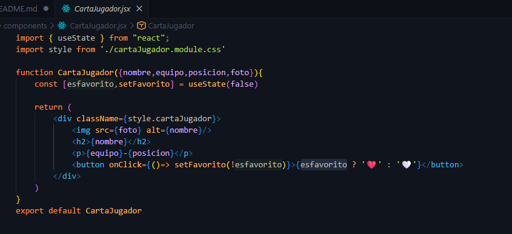
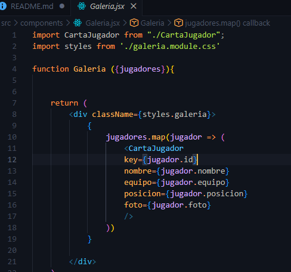
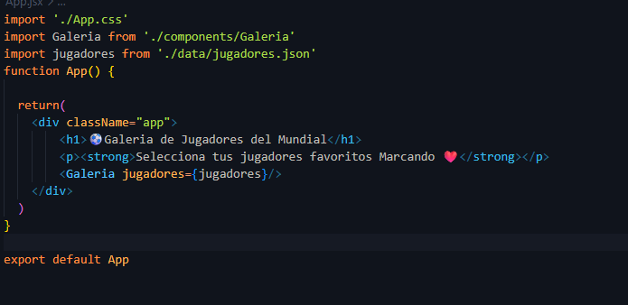
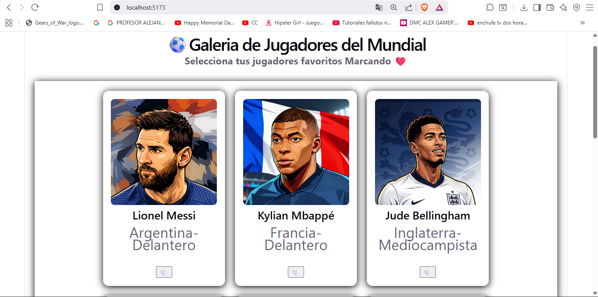
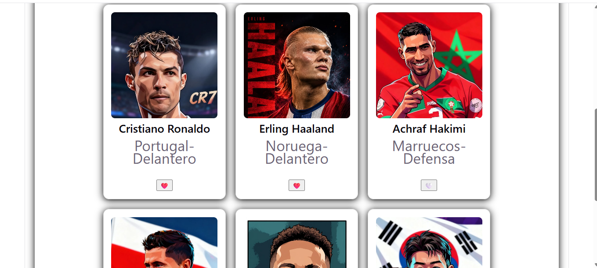
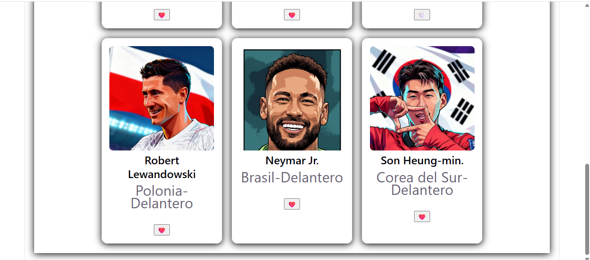

<div align="center">

# Instituto Tecnológico Nacional de México

### Instituto Tecnológico de Oaxaca

**Carrera:** Ingeniería en Sistemas Computacionales <br><br><br><br>
**Materia:** Programación Web <br><br><br><br>
**Unidad:** Unidad 3 <br><br><br><br>
**Docente:** Adelina Martínez Nieto <br><br><br><br>
**Alumno:** Enríquez Rodríguez Alejandro Guillermo <br><br><br><br>
**Fecha de entrega:**  9 de Julio 2026 <br><br><br><br>

</div>

---

# ⚽ Galería de Jugadores del Mundial — en React

## Preguntas

**a) ¿Qué diferencia hay entre props y state en React?**

Los props los recibe como parámetro el componente, se los pasa el componente padre, y el componente que los recibe no los puede modificar, solo los usa para mostrar información. En cambio, el useState se usa como una variable que tiene un estado que sí puede ser modificado por el propio componente. En mi primer componente lo ocupo para saber si un jugador es favorito, el estado inicial es false y cada que el usuario le da click a un jugador porque es favorito, el estado se cambia a true.


**b) ¿Por qué es importante usar una key al renderizar una lista de elementos?**

Es importante usar una key para que react pueda identificar cada elemento de una lista cuando esta cambia, ya sea que se agregue un elemento, se reordene o se borre alguno. En mi caso hice una galería de cartas de jugadores, y como son varias, la key le sirve a React para identificar cada carta de forma individual.

**c) Explica con tus propias palabras qué hace la función useState y da un ejemplo de dónde la usaste en tu mini aplicación.**

La función useState nos regresa dos campos, uno es el valor actual del estado y el otro campo es para modificar ese valor actual, nos ayuda a crear una variable de estado para ocuparlo en nuestro componente, el valor actual lo mantiene cuando hacemos renderizados pero puede cambiar. En mi aplicación lo ocupo en mi componente de CartaJugador, donde esfavorito es mi variable que está inicializada en false y setFavorito es la función que lo cambia, cuando el usuario le da click al botón de corazón, se llama a la función setFavorito el cual modifica el estado de mi variable esFavorito, lo invierte entre true y false, al volver a renderizar el componente, se actualiza el elemento mostrando el corazón correspondiente.

**d) Enlace del repositorio de GitHub**

https://github.com/AlejandroGuillermo7/t3_act5_react

**e) Enlace del proyecto desplegado en GitHub Pages**

https://alejandroguillermo7.github.io/t3_act5_react/

---


## Descripción


La aplicación simula una galería de jugadores del Mundial, donde cada 
jugador se muestra en una tarjeta con su foto, nombre, equipo y posición. 
El usuario puede marcar y desmarcar jugadores como favoritos haciendo clic 
en el botón de corazón ❤️.

---
### Ocupando Props, useState, componentes jsx, renderizado





## Componentes principales

### `App.jsx`
Componente raíz. Renderiza el título, la descripción y el componente `Galeria`, 
pasándole el arreglo de jugadores como prop.

### `Galeria.jsx` — Lista dinámica con `.map()`
Recibe el arreglo `jugadores` como prop y recorre cada elemento con `.map()`, 
renderizando un componente `CartaJugador` por cada jugador. Cada tarjeta 
recibe una `key` única (`jugador.id`) para que React pueda identificar cada 
elemento de la lista de forma eficiente.

### `CartaJugador.jsx` — Props + Estado + Eventos
Componente que recibe **props** (`nombre`, `equipo`, `posicion`, `foto`) y 
maneja su propio **estado** local con `useState` para controlar si el 
jugador está marcado como favorito. El **evento** `onClick` en el botón 
alterna ese estado entre `true` y `false`, cambiando el ícono entre 🤍 y ❤️.

```jsx
const [esFavorito, setFavorito] = useState(false)

<button onClick={() => setFavorito(!esFavorito)}>
  {esFavorito ? '❤️' : '🤍'}
</button>
```

---

## Estructura del proyecto

```
t3_act5_react/
├── README.md
├── index.html
├── package.json
├── vite.config.js
├── public/
│   └── imagenes/          
│       ├── messi.jpg
│       ├── mbappe.jpg
│       └── ...
└── src/
    ├── main.jsx
    ├── App.jsx
    ├── App.css
    ├── index.css
    ├── data/
    │   └── jugadores.json    
    └── components/
        ├── Galeria.jsx
        ├── galeria.module.css
        ├── CartaJugador.jsx
        └── cartaJugador.module.css
```


---

## Capturas de pantalla — app funcionando

### Galería completa


### Jugadores marcados como favoritos




---

## Tecnologías utilizadas

- **React 18** 
- **Vite** 
- **CSS Modules**
- **gh-pages** 

---

## Video de referencia

[CURSO de REACT desde cero 2025](https://youtu.be/2xhAcqhSuVU)


---

## Autor

**Enríquez Rodríguez Alejandro Guillermo**

Mini aplicación de práctica en React: galería interactiva de jugadores del 
Mundial con componentes, props, estado y renderizado de listas.
